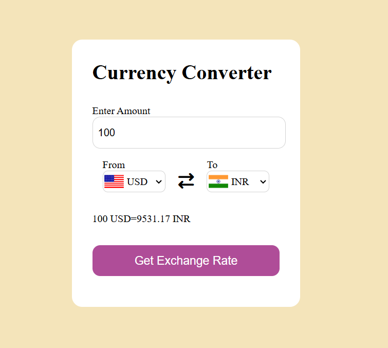

Currency Converter

A simple and responsive Currency Converter web application built using HTML, CSS, and JavaScript. It fetches live exchange rates using an exchange rate API and allows users to convert currencies instantly.

Features

- Convert between multiple currencies
- Live exchange rates
- Country flags
- Currency swap button
- Responsive design
- Simple and clean interface

Technologies Used

- HTML5
- CSS3
- JavaScript (ES6)
- Exchange Rate API

Screenshot



Project Structure

```
Currency-Converter/
│
├── index.html
├── style.css
├── script.js
├── codes.js
└── README.md
```

Live Demo

https://kangnagupta1225.github.io/Currency-Converter/

How to Run

1. Clone the repository
2. Open `index.html` in your browser

Author

Kangna Gupta

⭐ If you like this project, consider giving it a star!